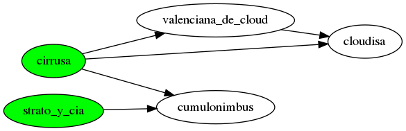

## Overview

Solución al ejercicio planteado en [README.md](README.md)

* [1 Pareto dominancia](#1-pareto-dominancia)
* [2 frontera de Pareto](#2-frontera-de-pareto)
* [3 escoger proveedor de cloud](#3-escoger-proveedor-de-cloud)
    * [a](#a)
    * [b](#b)
    * [c](#c)

### 1 Pareto dominancia

**Pintar un grafo donde los nodos son las opciones y existe una arista `a -> b` si la opción `a` pareto-domina la opción `b`, aunque sea a mano alzada y foto.**

### 2 frontera de Pareto

**Encontrar el conjunto de opciones que NO están pareto-dominadas por otras: estas opciones se llaman la [frontera de pareto o el conjunto de pareto](https://en.wikipedia.org/wiki/Pareto_efficiency#Pareto_frontier).**

Las opciones que no están pareto-dominadas por otras son: `cirrusa` y `strato y cia.`

### 3 escoger proveedor de cloud

#### a

**¿Qué opción escogerías? ¿Por qué?**:

Eligiría `strato y cia.` por obtener mejor sla y la opción de no explotar a niños por un coste mensual muy parecido. Si el objetivo del cambio fuese reducir costes explícitamente, la opción `cirrusa` sería la candidata.

#### b

**¿La opción que has escogido está en la frontera de pareto?**: Sí

#### c

**¿La opción que has escogido pareto-domina a nuestro provider actual, cloudisa?**: No
